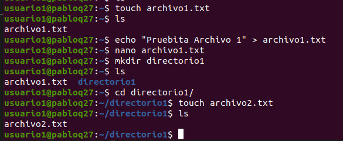

# Actividad 3

## Paso 1

comando para crear usuario.

- sudo adduser nombreUsuario

ver informacion por usuario
- id user

para ver informacion general de todos los usuarios
- getent passwd

para eliminar el usuario pero no el directorio
- sudo userdel usuario3

y luego se debe de configurar la el directorio con el siguiente

- sudo chown -R \$(whoami):$(whoami) /home/nombre_de_usuario

### Paso 2

Para crear grupos se utiliza el sigueinte comando
- sudo addgroup nombre_del_grupo

Para agregar usuarios a un grupo se utiliza
- sudo adduser nombre_de_usuario nombre_del_grupo

En la siguiente imagen se puede observar los usuarios agregados a los grupos

### Paso 3

Para cambiar de usuario desde consola se utiliza

- su nombre_usuario

para crear el archivo se utiliza 

- touch nombre_archivo

para agregar texto se puede utilizar nano o el siguiente comando
- echo "texto dentro del archivo" > archivo.extension

para crear un directorio 

- mkdir directorio

Verificar Permisos:

Para verificar los permisos del archivo:

- ls -l archivo1.txt

Para verificar los permisos del directorio: 

- ls -ld directorio1

Modificar Permisos usando chmod con Modo Numérico:

Para cambiar los permisos del archivo1.txt: 

- chmod 640 archivo1.txt

Modificar Permisos usando chmod con Modo Simbólico:
Para agregar permiso de ejecución al propietario del archivo2.txt: 

- chmod u+x archivo2.txt
- Cambiar el Grupo Propietario:

Para cambiar el grupo propietario de archivo2.txt a grupo1: 

- chown :grupo1 archivo2.txt
Configurar Permisos de Directorio:

Para cambiar los permisos del directorio1: chmod 750 directorio1
Comprobación de Acceso:

Intenta acceder al archivo1.txt y directorio1/archivo2.txt como usuario2.
Verificación Final:

Para verificar los permisos y propietario de los archivos: 

- ls -l archivo1.txt archivo2.txt

Para verificar los permisos y propietario del directorio: 

- ls -ld directorio1

